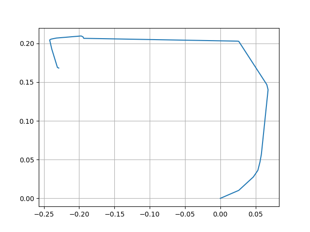

# Lab 6 Report

## Two advantages and disadvantages of teleoperation
### Advantages
- It is extremely simple and intuitive to get the robot from one start position to a goal position. There is no need for complex algorithms or control systems
- A human operator can respond to edge cases and allow dynamic response to situations that would be difficult to be hard coded. Even something as simple as lining up to the start line and starting at the same time is much easier with a human operator
### Disadvantages
- The latency between the input command and the actual action of the robot makes it difficult to operate the vehicle accurately and precisely
- If the conncection is unstable and becomes disconnected, the robot cannot take any action

## Plot
- note that the data collection stopped in the middle of the run so it is partially incomplete
- Code to make the plot is shown below:
```
from numpy import *
import matplotlib.pyplot as plt

t 	= ''
times 	= []
inputs 	= []
with open('teleopLog.txt') as f:
	for line in f:
		# extract the time
		for i in range(6,len(line)):
			if line[i] == ':':
				break
			else:
				t = t+line[i]
		times.append(float(t))
		t = ''

		# extract input
		if line[len(line)-4] == '5':
			# check if turning left or not
			if line[len(line)-6] == '-':
				inputs.append(-1)
			else:
				inputs.append(1)
		else:
			# otherwise it is stopped
			inputs.append(0)
		
dt = []
for i in range(1, len(times)):
	dt.append(times[i] - times[i-1])

'''
lets assume that:
- (1500,1500,1500,1500) is .1 m/s
- (1500,1500,-1500,-1500) is pi/4 rad/s CCW
robot starts at (0,0) with orientation facing the positive x axis
'''

x = 0.
y = 0.
pose = array([x,y])
pose_log = [copy(pose)]
theta = 0
w = 7*pi/6
v = .1
for t, i in zip(dt, range(1,len(dt))):
	if inputs[i] == 1:
		x += t*v*cos(theta)
		y += t*v*sin(theta)
	elif inputs[i] == -1:
		theta += t*(w)
	else:
		x = pose[0]
		y = pose[1]
	pose = array([x,y])
	pose_log.append(copy(pose))

pose_log = array(pose_log)
plt.grid()
plt.plot(pose_log[:,0], pose_log[:,1])
plt.savefig('plot.png')
plt.show()
```

